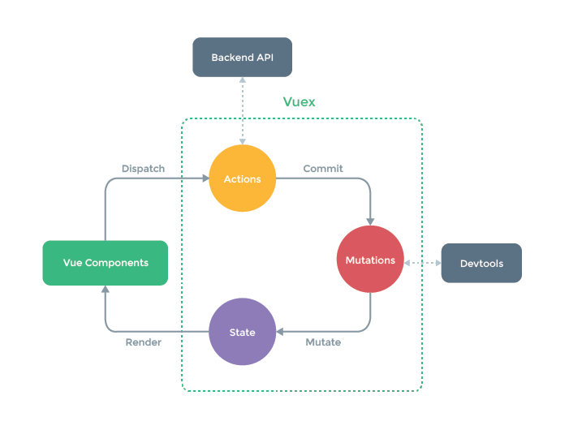

##특징
- Vue-상태값을 중앙집중화(한곳에서 관리)
- 상태값을 직접변경이 아닌 mutations(변이)을 통해서만 변경할 수 있어야함, 또한 devtool로 추적가능
- mutations은 상태값을 유지하며 새로운 값을 생성해낸다. 이는 Array.prototype.filter와 유사하다.
- mutations은 동기적인 구동방식이며 coumputed와 같이 사용한다. 이는 비동기 처리를 수행할 수 없다. 정의된 순차적 흐름을 가지며 로직을 파악할 수 있는 성격을 가진다.
- actions은 비동기적인 작업방식이며 methods와 같이 사용한다.

##표현
- state(상태) - 애플리케이션 데이터
- mutations(변이) - 상태를 변경하는 함수들을 보유하고 있는 객체
- store - 저장소

##폴더구조
https://codesandbox.io/s/w05j5l4865

##Vuex 선언
/assets/js/store/index.js

```
import Vue from "vue";
import Vuex from "vuex";

Vue.use(Vuex);

let store = new Vuex.Store({
    state: {},
    mutations: {}
});

export default store;
```

##Vuex 등록
main.js  

```
import store from "./assets/js/store";

new Vue({
    el: "#app",
    store,
    components: { App },
    template: "<App/>"
});
```

##getters 선언
첫번째 매개변수는 state내용을 받는다.

/assets/js/store/index.js
```
let store = new Vuex.Store({
    state: {
    counter: 0
    },
    getters: {
        getCounter(store) {
            return store.counter;
        }
    }
});

export default store;
```

##getters 등록
- getters 등록 방법은 여러가지 있다(computed 코드 참고).
- 사용할 탬플릿에 computed에 getters를 선언하여 등록한다(쉽게 설명하자면 computed에 넣어야겠다 할 내용들을 Vuex에 선언하면 된다).
- webpack의 babel을 이용하여 전개연산자를 사용하는 경우 'babel-preset-stage-2'를 설치가 필요하다. 아래의 .babelrc파일에 추가한다.

&nbsp;  
.babelrc
```
{
 "presets": ["stage-2"]
}
```

/components/main.vue

```
<template>
    <div class="hello">
        {{ getCounter }}
    </div>
</template>

<script>
import { mapGetters } from "vuex";
export default {
    name: "Main",
    data() {
        return {};
    },
    computed: { // 본인이 편한 방법중 택1
        ...mapGetters(['getCounter'])
    
        or
    
        mapGetters({
            parentCounter : 'getCounter'
        })
    
        or
    
        getCounter(store) {
            return this.$store.getters.getCounter;
        }
    }
};
</script>
```

##Mutations 선언
mutations에 선언된 메소드의 첫번째 매개변수 또한 state내용을 받는다.

/assets/js/store/index.js

```
let store = new Vuex.Store({
    state: {
        counter: 0
    },
    getters: {
        getCounter(store) {
            return store.counter;
        },
        mutations: {
            increCount(store, payload) {
            return store.counter++;
        },
        decreCount(store, payload) {
            return store.counter--;
        }
    }
});
export default store;
```

##Mutations 등록
this.$store.mutations.method 형태의 접근은 불가능하다.

/components/main.vue

```
<template>
    <div class="hello">
        {{ getCounter }}
        <button type="button" @click="increCount">increCount</button>
        <button type="button" @click="decreCount">decreCount</button>
    </div>
</template>
<script>
import { mapGetters } from "vuex";
export default {
    name: "Main",
    data() {
        return {};
    },
    computed: {
        ...mapGetters(['getCounter'])
    },
    methods: {
        increCount() {
            this.$store.commit("increCount");
        },
        decreCount() {
            this.$store.commit("decreCount");
        }
    }
};
</script>
```

##Actions 선언
- 첫번째 매개변수 contaxt는 저장소 인스턴스의 같은 메소드들/프로퍼티 세트를 드러내는 컨텍스트 객체를 받는다.
- actions의 함수가 호출이되어 mutations의 함수를 트리거한다. 이러한 형태는 다음의 이미지구조와 같다.

DOM event -> actions -> mutations -> state변경

```
let store = new Vuex.Store({
    state: {
        counter: 0
    },
    getters: {
        getCounter(store) {
        return store.counter;
        }
    },
    mutations: {
        increCount(store, payload) {
            return store.counter++;
        },
        decreCount(store, payload) {
            return store.counter--;
        }
    },
    actions: {
        increCount(context) {
            return context.commit("increCount");
        },
        decreCount(context) {
            return context.commit("decreCount");
        }
    }
});

export default store;
```
    
##Actions 등록
- Mutations의 호출은 commit('methodname')
- Actions의 호출은 dispatch('methodname')
    
```
<template>
    <div class="hello">
        {{ getCounter }}<br><br><br>
        <button type="button" @click="increCount">increCount</button>
        <button type="button" @click="decreCount">decreCount</button>
    </div>
</template>
<script>
import { mapGetters } from "vuex";
export default {
    name: "Main",
    data() {
        return {};
    },
    computed: {
        ...mapGetters(["getCounter"])
    },
    methods: {
        increCount() {
            this.$store.dispatch("increCount");
        },
        decreCount() {
            this.$store.dispatch("decreCount");
        }
    }
};
</script>
```

##Mutations와 Actions 차이점
- Mutations  
본질적으로 이벤트이며, 이름과 핸들러가 있다
상태를 수정 하는 유일한 방법 이다.
비즈니스 로직에 관심이 없다. 단지 '상태'에 중점을 둔다

- Actions  
Mutations를 전달하는 함수이다.
비즈니스 로직이다
한 번에 1 개 이상의 mutations를 전달 할 수 있다 . 비즈니스 로직을 구현하기 만하면 데이터 변경 (mutations로 관리)